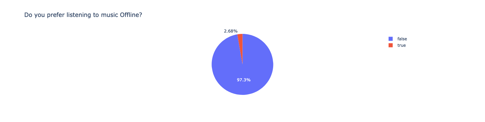

# Apple_Music_Analysis
A short data analysis project delving into my personal music streaming data from Apple Music, offering insights into my music listening habits, preferences, and trends over time.

The analysis was conducted through the use of a Jupyter Notebook which can be viewed [here](https://nbviewer.org/github/NathanDawson/Apple_Music_Analysis/blob/main/Apple_Music.ipynb).

 

### Data Preperation and Cleaning
1. Load DataSet (csv file)
2. Check shape and columns of dataframe
3. Check for columns with all NULL values and remove

 

*The DataFrame has many columns which have all NULL values, with such columns needing to be removed. The aim is to make the above HeatMap as dark as possible (i.e remove any white marks). Once these columns are removed, data analysis can start.*
  
 

### Data Analysis Summary

*Who are my top 10 favourite artists?*

  
*What are my top 20 favourite songs?*

*What are the top 10 songs I have listened to for the longest time?*

  
*What is the reason for the ending of the song?*

*What media type do I use the most?*

*Do I listen to music more offline or online?*

  
*What time do I prefer to listen to music?*  

*What month do I listen to music most?*

*Which year have I listened to music most?*

*What is the total time I have spent listening to Apple Music?*

